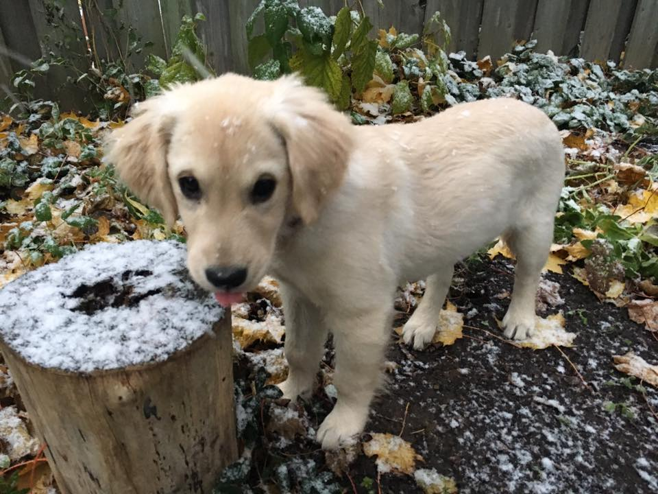

  <h1>About Me</h1>

I'm Lee Combs and I recently moved to London, Ontario. I'm looking to start my career as a software developer. I'm into gaming, reading, traveling, board games, and I recently got dog and a cat!

# Programming background

I am a self-taught developer who got my start by pursuing an interest in game development. My first language was **Actionscript 3**, which I learned while tinkering with game code and using the **Flixel** framework.

Since then I have received a Computer Systems Technology diploma from Camosun College and am looking to start my career. From there I have started a handful of projects in an attempt to learn new languages, and am most comfortable with **C#**. I have messed around a bit in **Haxe**, **Ruby**, **Go**, **Python**, **C**, and **C++**. You can check out my [projects page](http://leecombs.me/category/projects.html) to see more about my side projects.

# Hobbies etc.

Video games mainly. I got hooked early with the Nintendo, then the PlayStation, PC, Xbox. I have the current gen consoles and am playing Dragon Quest XI, Super Mario Odyssey, and The Division. I'm looking forward to Smash Ultimate, Kingdom Hearts 3, and Guacamelee 2! I'm also an avid board game fan and have been playing Takenoko, Catan, Rummikub, and Carcassonne. I'm currently the reigning champ of board games for in my house.

I've been getting back into reading and am currently working through Terry Pratchett's Disc World novels. I really enjoy Jack Whyte's books about the Camulod Chronicles, of which I first read Uther in high school.

Not long after we moved out here, we adopted two animals! A golden retriever named Zelda, and an orange tabby named Cinder.

  
  

